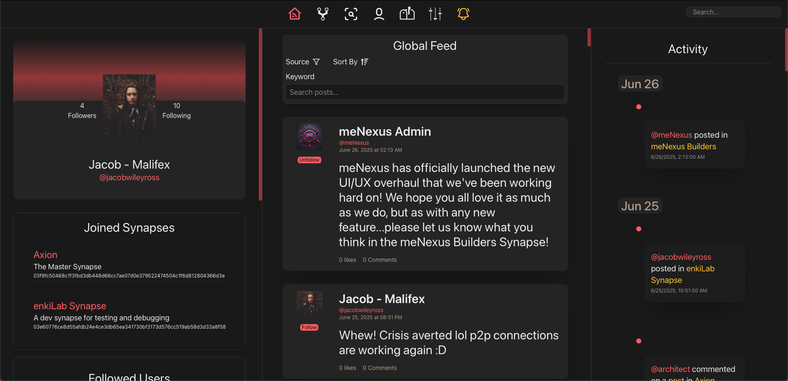

# meNexus: a peer-to-peer social layer for the open internet

[](LICENSE)
[](#-local-quickstart)

---

<p align="center">
    
</p>

## ❓ What is meNexus?

**meNexus** is a decentralized social networking platform designed to empower individuals and communities by fostering meaningful connections, autonomy, and collaboration. At its core, meNexus operates through interconnected nodes called **Synapses**, enabling users to create, share, and interact without centralized authorities.

Synapses form a mesh of evolving, user-hosted communities.

🔗 Learn more about the vision in [docs/OVERVIEW.md](docs/OVERVIEW.md)

---

## 🛠️ Local Quickstart

<details>
<summary><strong>1. Clone the monorepo</strong></summary>

```bash
git clone https://github.com/Malifex-LLC/meNexus-platform.git
cd meNexus-platform
```

</details>

<details>
<summary><strong>2. Create the MySQL schema & OrbitDB root</strong></summary>

```bash
# Generate the MySQL schema
mysql -u root -p < services/synapse/src/utils/menexus_schema.sql

# Generate the OrbitDB root (prints the address)
node services/synapse/src/utils/createGlobalUsersDB.js
```

📋 Copy the OrbitDB address shown in the terminal — you’ll need it for the `.env` file in step 3.

</details>

<details>
<summary><strong>3. Configure environment files</strong></summary>

### `services/synapse/.env`

```env
# HTTP / WebSocket
EXPRESS_PORT=3001

# MySQL connection
DB_SOCKETPATH=/tmp/mysql.sock       # omit on Windows
DB_HOST=localhost
DB_PORT=3306
DB_USER=            # your MySQL user
DB_PASSWORD=        # your MySQL password
DB_DATABASE=menexus_schema

# OrbitDB global users database
GLOBAL_USERS_DB_ADDR=/orbitdb/...   # paste from step 2
```

### `apps/client-web/.env`

```env
VITE_API_BASE_URL=http://localhost:3001
VITE_WS_BASE_URL=ws://localhost:3001
```

</details>

<details>
<summary><strong>4. Install dependencies</strong></summary>

```bash
pnpm install             # install all packages in the monorepo
pnpm approve-builds      # approve native builds for @ipshipyard/node-datachannel
```

</details>

<details>
<summary><strong>5. Run Synapse and the web client</strong></summary>

```bash
# Terminal 1 – Start back-end
pnpm run dev:synapse     # Synapse API on http://localhost:3001

# Terminal 2 – Start front-end
pnpm run dev:client      # Vite dev server on http://localhost:5173
```

🌐 Open [http://localhost:5173](http://localhost:5173) in your browser, register a user, and start exploring.

</details>


🎉 You now have a single-node meNexus instance running entirely on your machine.

---

## 📄 License

This project is licensed under the **GNU Affero General Public License v3.0 or later**.  
See [LICENSE](LICENSE) for full details.

---

## 🙏 Acknowledgements

- Paul Miller – [`noble-secp256k1`](https://github.com/paulmillr/noble-secp256k1)
- The amazing teams behind **libp2p**, **IPFS**, and **OrbitDB**

Made with ❤️ by [Malifex](https://github.com/Malifex-LLC) and hopefully the open-source community.
