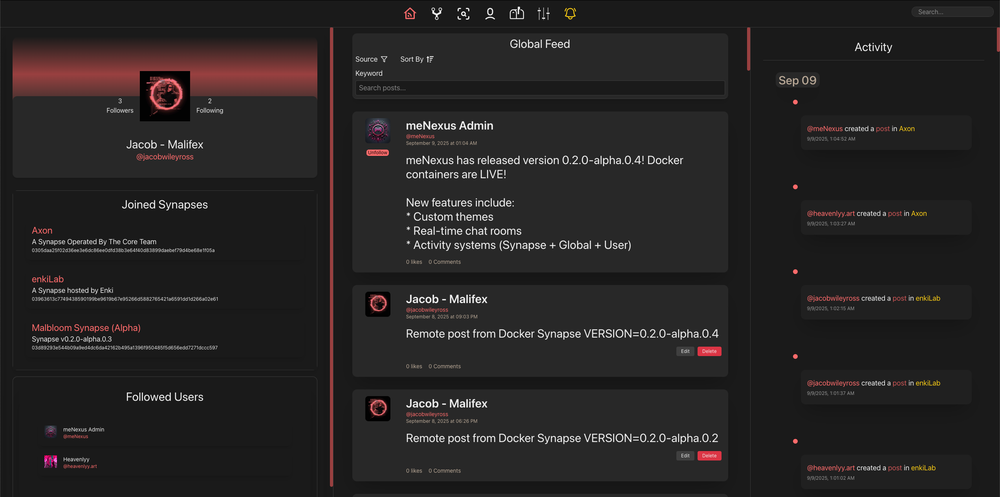

# meNexus: a peer-to-peer social layer for the open internet

[](LICENSE)
[](#-local-quickstart)

---

<p align="center">
    
</p>

## ❓ What is meNexus?

**meNexus** is a decentralized social networking platform designed to empower individuals and communities by fostering meaningful connections, autonomy, and collaboration. At its core, meNexus operates through interconnected nodes called **Synapses**, enabling users to create, share, and interact without centralized authorities.

Synapses form a mesh of evolving, user-hosted communities.

🔗 Learn more about the vision in [docs/OVERVIEW.md](docs/OVERVIEW.md)

---

## 🛠️ Quickstart

### Option 1: Run with Docker (recommended)

<details>
<summary><strong>1. Clone the repository</strong></summary>

```bash
git clone https://github.com/Malifex-LLC/meNexus-platform.git
cd meNexus-platform/deploy/compose
```
</details>

<details>
<summary><strong>2. Copy the sample environment file</strong></summary>

```bash
cp .env.sample .env
```

</details>

<details>
<summary><strong>3. Edit `.env` to configure your new Synapse</strong></summary>

* If hosting client publicly, set `PUBLIC_URL` to your domain (must start with https://). If running locally, leave it as http://localhost
* Point your DNS to your host machine’s IP if using a custom domain 
* Add a valid contact email (used for ACME / Let’s Encrypt)
* Set `EXTERNAL_IP` to your host machine’s public IP address

</details>

<details>
<summary><strong>4. Bootstrap secrets</strong></summary>

```bash
docker compose run --rm bootstrap
```

This generates secure MySQL passwords and other required secrets

⚠️ You only need to run this once per environment

</details>

<details>
<summary><strong>5. Start the stack</strong></summary>

```bash
docker compose up -d
```

</details>

Your Synapse will now be running at http://localhost (or your configured PUBLIC_URL if hosting publicly)

### Option 2: Run locally for development
Please see [docs/LOCAL_DEV.md](docs/LOCAL_DEV.md)

---

## 📄 License

This project is licensed under the **GNU Affero General Public License v3.0 or later**.  
See [LICENSE](LICENSE) for full details.

---

## 🙏 Acknowledgements

- Paul Miller – [`noble-secp256k1`](https://github.com/paulmillr/noble-secp256k1)
- The amazing teams behind **libp2p**, **IPFS**, and **OrbitDB**

Made with ❤️ by [Malifex](https://github.com/Malifex-LLC) and hopefully the open-source community.
