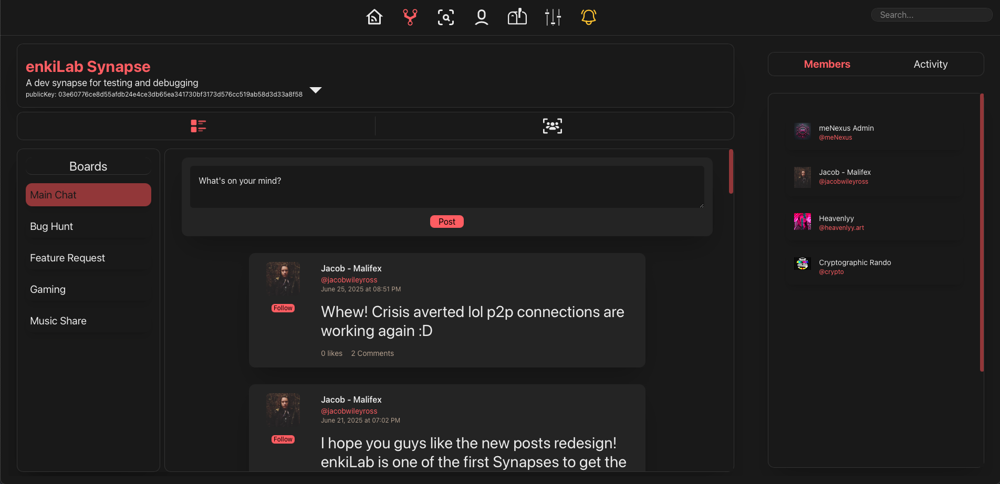
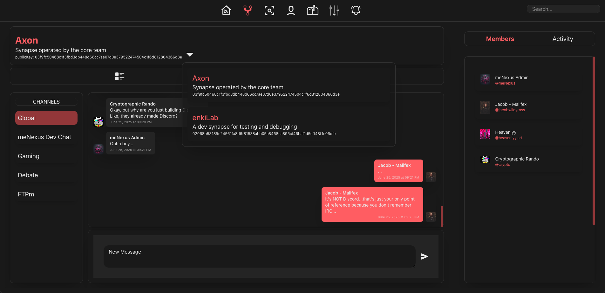
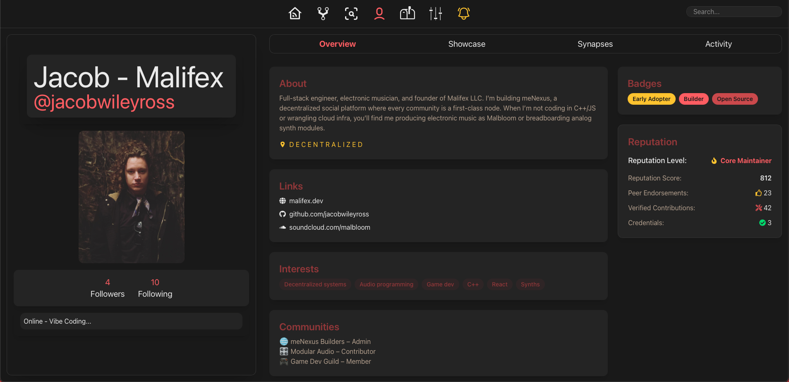

<!-- docs/overview.md — Vision & Experience -->

# meNexus
*A peer-to-peer social layer for the open internet*

> ⚠️ **Note**: This document includes planned features that are not yet implemented. It outlines the intended vision 
> and future capabilities of meNexus, alongside current functionality. See the [Roadmap](#9-roadmap-at-a-glance) for 
> development status.

---

## 1. Vision

meNexus exists to make profiles **portable**, communities **sovereign**, and **users** truly interconnected and 
**social** again. Instead of forcing diverse users into a one-size-fits-all platform and experience, meNexus turns every
community into a **Synapse**—an autonomous configurable node that can still talk to every other node.

---
## 2. Core Principles
* **Decentralization**: Create a network where control is distributed among users and communities. No central servers,
    no single point of failure.
* **Portability**: Your global identity is yours. It works across any Synapse, always.
* **Sovereignty**: Every Synapse defines its own data, rules, and culture. Autonomy by design.
* **Interconnectivity**: Build a network where Synapses communicate seamlessly, enabling collaboration and shared 
    experiences across the network.
* **Resilience**: Develop a platform that is robust, fault-tolerant, and adaptable to the needs of its users.
---

## 3. Architecture at a Glance
meNexus is built on a modular, decentralized architecture that separates user identity, local Synapse logic, and 
inter-Synapse communication.
* **Global User Identity**: 
  * Each user generates a secp256k1 public/private key pair locally.
  * Public identity data (e.g. public key, handle, display name, etc.) is stored in a shared global OrbitDB, replicated across all 
    Synapses.
* **Synapse**: 
  * A self-hosted server running on Node.js + Express, backed by MySQL for local data persistence.
  * Uses libp2p for peer discovery, pub/sub messaging, and direct peer communication.
  * Hosts all posts, comments, chats, and other content accessible via the client dashboard.
* **Federation & Communication**: 
  * A custom Synaptic Nexus Protocol (SNP) defines how Synapses exchange data securely and predictably.
  * A dedicated Messenger API, built on top of libp2p, handles peer-to-peer requests for posts, comments, profiles, and 
    chat threads.
  * Each Synapse can retrieve and cache data from others while maintaining local autonomy.
---

## 4. User Experience & Features

### Onboarding
* Generate a **public/private secp256k1 key-pair** locally.
* Choose a handle and display name; these are written to the global OrbitDB where other Synapses can replicate them.
* Register from **any** Synapse. Your identity is portable.
* Need an easy starting point? Join **Axon**, the Synapse hosted and managed by the core team.
---

### Dashboard

  
   <em>Figure 1 – Global dashboard with feed and activity panels.</em>

* **Header** – One-click nav to Dashboard, local Synapse, Explore, Profile, DMs, Settings, and Notifications.
* **Control Panel** – Handle, display name, follower/following counts, and shortcuts to joined Synapses & followed users.
* **Global Feed** – Aggregates posts from all joined Synapses *and* followed users. Filter by source, sort by *Recent* 
    or *Trending*, or search by keyword.
* **Activity Panel** – Real-time view of what your network is doing—new posts, joins, follows, etc.

---

### Synapse Page
Feed view

  

  
Chat view  

  

* **Synapse Toolbar** – Dropdown to hop between any of your joined Synapses.
* **Tab Switcher** – Toggle between **Feed** (long-form posts) and **Chat** (real-time rooms).
* **Members / Activity** – Side panel that shows either a member list or live activity stream for the selected Synapse 
    (new joins, posts, comments).
---

### User Profile

  

A profile is more than a post timeline. It shows **who** you are and **how** you contribute.

* **Identity Panel** – Display name, handle, avatar, follower stats, a customizable status badge (e.g., vibe coding or 
    gaming), and quick actions for follow, DM, or Invite
* **Overview** – Bio & location, external links, core interests, favourite communities, badge showcase, and a Reputation 
    widget (level, endorsements, verified contributions/credentials).
* **Showcase** – Hand-picked highlights—badges, top posts, featured Synapses, or external projects.
* **Synapses** – Complete list of communities the user belongs to.
* **Activity** – Timeline of key events for that user: posts, comments, follows/unfollows, joins/leaves.

## 5. Extended Capabilities
Beyond its core social functionality, meNexus will include a set of powerful built-in features to support community 
expression, monetization, and digital exchange:

* **🎨 Expression & Community Culture** - Customize how your community looks, feels, and celebrates its members.
  * **Custom badges & achievements** – Let Synapse admins create custom badges, emojis, flair, or reputation titles.
  * **Event tools** – Create and promote community events (e.g. livestreams, drops, AMAs) natively within a Synapse.
  * **Status-driven UX** – Show what users are “up to” (vibe coding, music, gaming) with presence-aware status badges.
* **📁 Peer-to-Peer File Distribution** - Each Synapse can distribute files freely or for a fee:
  * Share community zines, digital art, music packs, or tools directly 
  * Optional pricing lets creators earn directly from their Synapse without needing third-party platforms
* **🔐 Premium Access Controls** - Monetize content and access with built-in gating mechanisms:
  * Restrict your entire Synapse behind a paywall (e.g., private creative networks, subscription communities)
  * Lock individual boards, chat channels, or file downloads as premium content

## 6. Governance & Moderation
meNexus does not enforce a global code of conduct. Instead, each Synapse defines its own standards of acceptable 
behavior. One community might restrict profanity, another might embrace it. This flexibility allows for diverse 
cultures to flourish within the network. To support this, meNexus provides two key systems that empower Synapse 
hosts to shape and manage their communities:

* **Trust & Reputation**: **Elo-inspired score** (0-3000) shown globally *and* per-Synapse.
    * All content and interaction can be Endorsed (+) or Opposed (-) which will impact your reputation
    * Endorsements from high-reputation users carry more weight than those from lower-rep users
    * Opposition from high-reputation users likewise has a stronger negative effect
    * Reputation can directly influence user visibility and privileges within each Synapse

* **Roles and Moderators**: Each Synapse defines its own roles and permissions, allowing communities to self-govern as 
    they see fit.
    * All members can flag content or interactions for moderator review.
    * Moderators can remove content and Endorse/Oppose both content and users.
    * Custom roles may be granted the ability to Endorse or Oppose. These can be gated by reputation levels to:
      * Prevent low-rep users from damaging others’ reputations maliciously.
      * Guard against bad actors who "grind" the reputation system for access, only to abuse their privileges.
---

## 7. Extending meNexus

meNexus provides robust core functionality, but it's designed to be extended. Every Synapse runs on open-source 
code giving you the freedom to tailor features to your community’s unique needs.

You can host your own fork, publish modifications on GitHub, or share your work through the built-in Add-On Marketplace,
either for free or at a price. This creates space for a thriving ecosystem where power users and developers can 
contribute, collaborate, and even earn from their innovations.

meNexus is a platform, not a gatekeeper.
Fork it, self-host it, extend it, monetize it—or just hang out with friends.
The network thrives when you own your community.
---

## 8. Hosting Your Own Synapse

meNexus is built to be easy to deploy and self-host. The goal is to ship Synapse as a Docker container (or similar), 
enabling one-command deployment with minimal setup.

Each Synapse includes an Admin Dashboard that gives you full control over your community’s environment. From there, 
you can:

* Assign feed boards and chat channels
* Define user roles and assign moderators
* Set privacy and visibility preferences
* Remove harmful or unwanted content
* Customize features to fit your community’s culture 

Whether you're creating a private space for a few friends or launching a public hub, hosting your own Synapse means 
owning the tools to build the space you envision.
---

## 9. Roadmap at a glance

| Milestone                                                                               | Target   | Status  |
|-----------------------------------------------------------------------------------------|----------|---------|
| **v0.1 – Alpha**:     LAN peer discovery, local OrbitDB replication, web client MVP     | 2025-Q3 | 🟢 In Progress |
| **v0.15**:            WAN peer discovery via libp2p bootstrap nodes and relay support   | 2025-Q4 | ⬜ Planned     |
| **v0.2**:             Docker container release, cross-Synapse OrbitDB replication over WAN | 2025-Q4 | ⬜ Planned     |
| **v0.3**:             Admin Dashboard UI, Trust & Reputation system (ELO-style scoring) | 2026-Q1 | ⬜ Planned     |
| **v1.0 – Beta 1**     libp2p, OrbitDB, and SNP hardening; stable inter-Synapse interaction | 2026-Q2 | ⬜ Planned     |

---

## 10. License & Contributor Terms

- **Code**: [GNU AGPL-3.0-or-later](https://www.gnu.org/licenses/agpl-3.0.html)
- **Docs & Assets**: [Creative Commons BY-SA 4.0](https://creativecommons.org/licenses/by-sa/4.0/)
- **Contributions**: All commits require a `Signed-off-by` line (Developer Certificate of Origin).

See [`LICENSE`](../LICENSE) and [`DCO`](../DCO) for full text.

